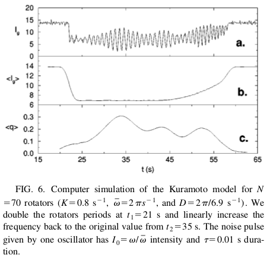
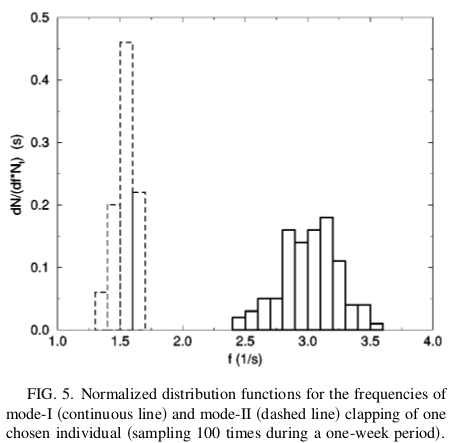

# The Physics of Applause

> **Julien Varennes**

Kuramoto model applied to system of applause.

This project aims to replicate and expand on the simulations performed in the research paper [“Physics of the Rhythmic Applause”](http://journals.aps.org/pre/abstract/10.1103/PhysRevE.61.6987) by Néda, Z., E. Ravasz, T. Vicsek, Y. Brechet, and A. L. Barabási.

## My Simulation

The dynamics of each oscillator are the following:

$$
\dot{\phi}_k = \omega_k + \sum_{j=1}^N K_{j,k} \sin(\phi_j - \phi_k), \ \ j = 1, ..., N
$$

$\omega_k$ is the natural oscillation frequency of oscillator $k$ and is drawn from a natural distribution as prescribed in the paper.  $K_{j,k}$ is the coupling strength between oscillators and it is assumed that on average all audience members interact with one another with equal strength $K_{j,k} \to K/N$. So the above equation simplifies to

$$
\dot{\phi}_k = \omega_k + W_k^\text{int} \ , \\
W_k^\text{int} = \frac{K}{N}\sum_{j=1}^N \sin(\phi_j - \phi_k).
$$

In the Kuramoto model at least partial syncronization is only possible for $K>K_c$ where $K_c$ is the critical coupling strength.

$$
K_c = \sqrt{ \frac{2}{\pi^2} } D
$$

### Implementation

Each oscilator angle is updated using the Euler method.

$$
\phi_k(t+\Delta t) = f_k(t)\Delta t + \eta_k \\
f_k(t) = \omega_k + W_k^\text{int} \\
$$

$\eta_k$ is a random vairable with $\mu_\eta = 0.0$ and $\sigma_\eta^2 = \Delta t$. The function $f_k(t)$ is interpreted as the frequency of the oscillator.

## Paper's Simulation Results

This figure displays their simulation results. Each oscillator is initialized with a distribution of natural frequencies which is supposed to replicate the mode-I experimental frequency distribution (solid line).

